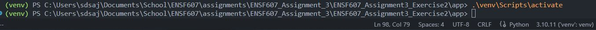
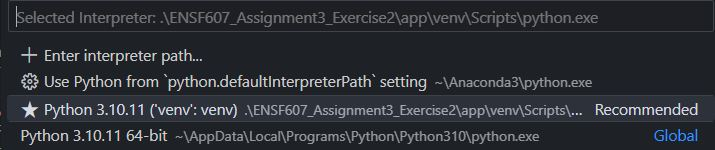
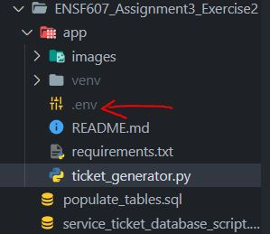
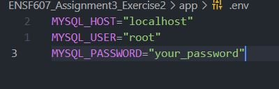
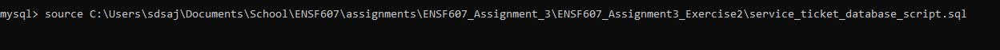
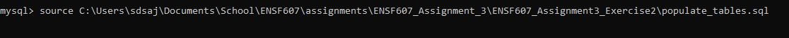
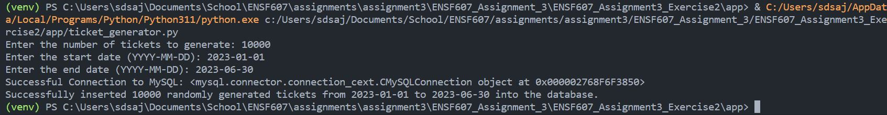
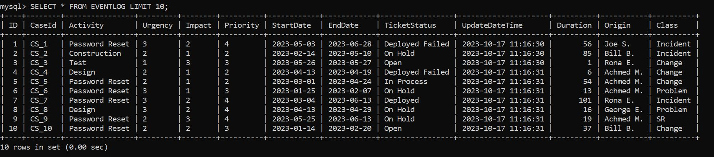

# Setup Instructions

1. Clone the GitHub repo

2. In the terminal, CD into the local file.

    

3. Setup the Virtual Environment

    `python -m venv venv`

4. Activate the Virtual Environment

    `.\venv\Scripts\activate`

    

5. Ensure that the interpreter path is correct (should point to \venv\Scripts\activate)

    

6. install the required libraries found in `requirements.txt`

    `pip install -r .\requirements.txt`

    Note, this can be done manually instead (`pip install python-dotenv`, etc.)

7. Create a `.env` file.

    Make sure that it's in the same directory as the `ticket_generator.py` file.

    

8. Enter your local mySQL credentials here

    

9. Start up mySQL from the command line client.

10. Create the database in mySQL

    `source C:\Users\sdsaj\Documents\School\ENSF607\assignments\ENSF607_Assignment_3\ENSF607_Assignment3_Exercise2\service_ticket_database_script.sql`

    

11. Populate the database tables in mySQL

    `source C:\Users\sdsaj\Documents\School\ENSF607\assignments\ENSF607_Assignment_3\ENSF607_Assignment3_Exercise2\populate_tables.sql`

    

12. Run the python program to generate 10,000 tickets

## Example of successful program execution

